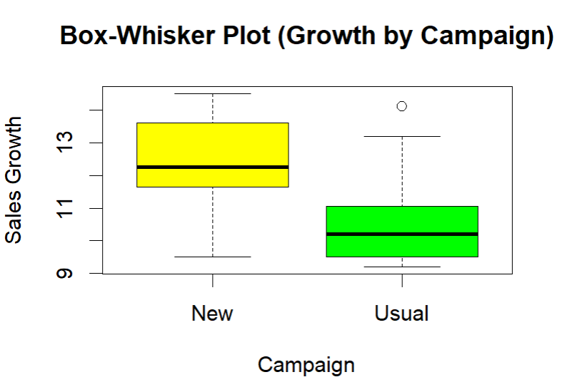

# One-Way ANOVA: Marketing Campaign Effectiveness Analysis

## Project Overview
This project presents a statistical analysis conducted in R to evaluate the effectiveness of a new marketing campaign compared to a usual campaign.  
The analysis also examines whether sales growth differs across geographical zones.

## Business Context
A large retail group tested a **new marketing campaign** in 12 randomly selected stores, while another 12 stores continued with the **usual campaign** during the same period.  
The key outcome variable is **Sales Growth**.

## Objectives
1. Assess whether the new marketing campaign is more effective than the usual campaign  
2. Evaluate the impact of **geographical zone** (West, South, East) on sales growth  

## Dataset
The dataset (`anova_assignment_data.csv`) is included in the repository and located in the root directory.  
It contains observations from **24 retail stores**.

### Dataset Description
Key variables:
- `Growth` — sales growth metric  
- `Campaign` — campaign type (`New`, `Usual`)  
- `Zone` — geographical zone (`West`, `South`, `East`)  

Store-to-zone mapping:
- West: stores 1–4 and 13–16  
- South: stores 5–8 and 17–20  
- East: stores 9–12 and 21–24  

## Analysis Workflow
1. Data import and structure inspection  
2. Normality assessment using graphical and statistical methods  
3. One-way ANOVA to compare campaign effectiveness  
4. Post-hoc analysis using Tukey’s HSD test  
5. One-way ANOVA to evaluate the effect of geographical zone  

## Methods and Techniques
- Exploratory data analysis:
  - QQ plots
  - Boxplots
- Normality tests:
  - Shapiro–Wilk test
  - Lilliefors (Kolmogorov–Smirnov) test
- Statistical analysis:
  - One-way ANOVA
  - Tukey’s HSD post-hoc test

## Key Findings
- A statistically significant difference in sales growth was observed between the **new** and **usual** marketing campaigns  
- Post-hoc analysis indicated that the **usual campaign outperformed the new campaign**  
- No statistically significant differences in sales growth were found across geographical zones (West, South, East)

  ## Visualization

## Tools and Skills
- R
- One-way ANOVA
- Post-hoc hypothesis testing
- Business experiment analysis
- Data visualization

## How to Run the Project
1. Clone the repository  
2. Open the R script  
3. The dataset (`anova_assignment_data.csv`) is already included in the repository 
4. Run the script sequentially  

## Notes
This project was completed for educational purposes and demonstrates the application of one-way ANOVA and post-hoc analysis in a business experimentation context.
